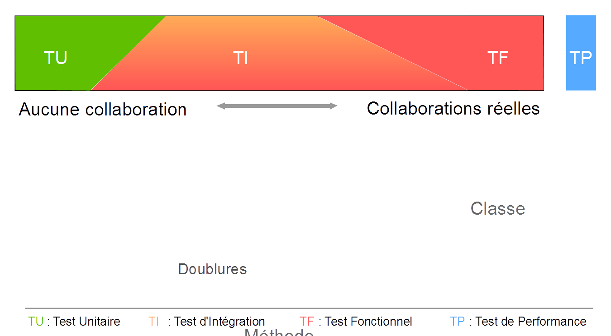
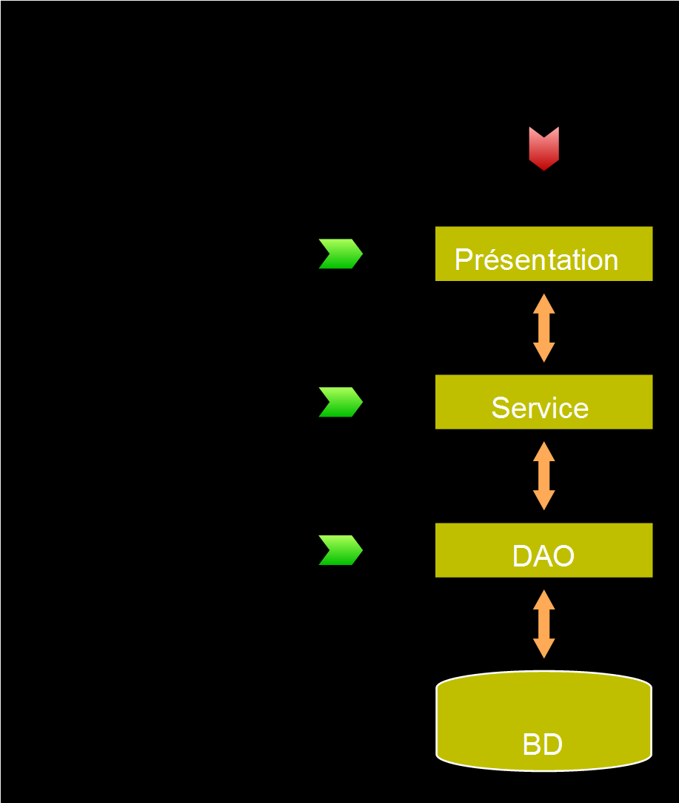

# Types de tests

## Les types de tests

- Pour chaque aspect il existe un type de test
  - Tester une unité (méthodes, classes, ...) sans tester le reste du système avec     
  lequel elle interagit : **Test unitaire**.
  - Tester la collaboration de ces unités (interactions partielles, interactions réelles     
  avec le reste du système) : **Test d'intégration**.
  - Tester le fonctionnement d'une application en se mettant à la place de      
  l'utilisateur : **Test fonctionnel**.
  - Tester les performances d'une application soumisse à de fortes 
  contraintes : **Test de montée en charge**.

--------

## Tests unitaires - Principes

- « Test unitaire » = « Test » + « unitaire ».
- Que veut dire « unitaire » ?
- Chaque « unité » interagit avec d'autres « acteurs »
  - « Acteurs » de la même application
    - Service, Repository, ...
  - « Acteurs » externes
    - Base de données.
    - Système de fichiers.
    - Web service.
    - Autre application.
    - ...

--------

## Tests unitaires - Principes

- Typiquement, un composant est une méthode ou une classe.
- *But* : Contrôler les entrées et vérifier les sorties
  - Contrôle absolu de l'environnement extérieur.
  - Permet de tester les cas aux limites.

--------

## Tests unitaires - Principe d'isolation

- L'exécution d'un test doit pouvoir être répétable
  - Chaque test doit pouvoir être joué à tout moment indépendamment des autres.
  - Sans notion d'ordre ou de dépendance.
  - Prédictif, toujours aboutir au même résultat.
  - Test Fixture (Banc d'Essai) assure qu'à chaque exécution un test démarre    
  dans le même état et donc produit le même résultat.
- L'exécution du test doit être rapide pour avoir un feedback immédiat.
- Respect du pattern *given-when-then* ou *AAA* (Arrange / Act / Assert).
- Encourage un faible couplage entre les composants.

--------

## Tests unitaires - Déroulement

- Initialisation du banc de test (**Setup**)
  - Composant à tester et préparation de l'environnement.
- Réglage de l'état initial du banc (**Given**)
  - Configuration de l'ensemble des valeurs du banc.
- Lancement du processus à tester (**When**)
- Analyse de l'état final du banc (**Then**)
  - Lecture de l'ensemble des valeurs du banc.
- Conclusion : OK / KO

--------

## Tests unitaires - Avantages (1/2)

- Plus sûr
  - Permet de valider chaque composant séparément.
  - Permet de localiser rapidement un mauvais fonctionnement.
- Plus rapide
  - Lors de l'exécution, n'a pas besoin de tout l'environnement réel : notion de banc de test.
- Plus tôt
  - Permet de tester sans que la totalité de l'environnement ne soit encore disponible.

--------

## Tests unitaires - Avantages (2/2)

- Plus concis
  - Évite de tester plusieurs fois la même fonctionnalité d'un composant.
- Plus précis
  - Permet de tester tous les cas aux limites : contrôle total de l'environnement extérieur.
- Plus robuste
  - Impact positif sur le design du code.
  - Ne va pas tomber en échec à chaque modification du code.

--------

## Tests unitaires - Inconvénients

- Plus de code à écrire et à maintenir
  - Dépendant du type de composant à tester.
  - Les tests doivent être maintenus au fur et à mesure de l'évolution du code à tester.
- Nécessité d'organiser et de structurer les tests
  - Éviter les dépendances entre tests.

--------

## Tests unitaires - Conclusion

- En général, plus d'avantages que d'inconvénients.
- Obligation dans les autres industries
  - Automobile
  - Aéronautique
  - Électronique
  - ...

--------

## Tests d'intégration - Principes

- Test en collaboration par opposition aux tests unitaires.
- *But* : vérifier que les unités fonctionnement bien ensemble
  - Interactions avec les autres composants incluses.
- Si le composant a déjà été testé unitairement
  - Simplement tester le cas nominal.
  - Pas besoin de re-tester tous les cas anormaux.
- Différents niveaux de tests d'intégration
  - Tests d'intégration entre plusieurs unités (2 ou plus).
  - Tests d'intégration avec toutes les unités de l'application (en milieu réel).

--------

## Tests d'intégration - Principes

- Le fait de tester en conditions réelles a des impacts.
- Exemples :
  - Invocation d'autres applications
    - Développement ou installation d'une instance de test.
  - Envoi d'email
    - Adresse email « poubelle ».
  - Modification des enregistrements de la base de données
    - Ré-initialisation de la BD entre chaque test.
  - ...

--------

## Tests d'intégration - Avantages

- Plus global
  - Permet de vérifier le bon câblage.
  - Permet de vérifier le bon fonctionnement des composants ensembles.
- Plus épuré
  - Pas besoin de tester tous les cas aux limites.
  - En général, un seul test par fonctionnalité pour tester la bonne 
  communication entre les composants.

--------

## Tests d'intégration - Inconvénients

- Plus fragile
  - Chaque composant peut générer une erreur (réseau, base de données, etc.).
  - Sensible aux modifications de code car plus de code couvert.
- Plus long
  - L'exécution demande le chargement de plus de composants.
  - Ralentissement dus aux chargements de base, latence réseau, etc.

--------

## Tests d'intégration vs Tests unitaires

- Tests unitaires beaucoup plus fin et précis
  - Positionnement manuel des valeurs du banc de test.
  - Permet de tester tous les cas plus facilement.
  - Permet de tester chaque fonctionnalité unitairement et non couplée à d'autres acteurs.
- Test d'intégration permet de tester plus globalement le bon fonctionnement/câblage 
de l'ensemble.
- Ces types de tests sont donc complémentaires
  - Il faut donc raisonner en terme de ROI.

--------

## Tests d'intégration - Conclusion

- Permet de tester la collaboration des composants ensembles.
- Couvre une plage allant de l'interaction de plusieurs composants au milieu réel.
- Peut ne tester que les cas nominaux.

--------

## Tests fonctionnels - Principes

- Tests dans un contexte réel, simulant un utilisateur.
- *But* : le but n'est plus de tester un à un chaque composant
  - Passage du test d'une API technique à un test de scénario fonctionnel.
- Test d'un point de vue utilisateur
  - Typiquement les tests utilisés pour la recette de l'application.
  - Souvent fait « à la main » en jouant avec l'application.
- Outils de test différents pour chaque type d'interface graphique.

--------

## Tests fonctionnels - Avantages

- Plus concret
  - Se met à la place d'un utilisateur pour tester le comportement réel de l'application.
- Plus rassurant
  - Vérifie que l'application **finale** se comporte correctement et pas seulement 
  l'ensemble de ses composants.

--------

## Tests fonctionnels - Inconvénients

- Très fragile
  - A chaque modification du code (même mineure : modification HTML, CSS, etc.),      
  le test risque de tomber en échec.
- Plus difficile à maintenir
  - Doit être mis à jour très souvent (à chaque modification).
  - Pas forcément très clair (beaucoup de variables à prendre en compte).

--------

## Tests fonctionnels - Conclusion

- Permet de tester l'intégralité de l'application, telle qu'elle va être utilisée.
- Très fragile et difficile à maintenir.

--------

## Tests de montée en charge - Principes

- Tester le comportement de l'application dans des conditions d'utilisation      
intensives (plusieurs dizaines, centaines ou milliers d'utilisateurs),      
évaluation des performances.
- Identifier de possibles problèmes :
  - Les goulets d'étranglement.
  - Les mauvaises configurations / paramétrages.
  - Les ressources critiques.
- Le but n'est pas de vérifier que l'application fonctionne correctement
  - Rôle des tests unitaires, d'intégration et fonctionnels.

--------

## Tests de montée en charge - Principes

- Ne doivent pas être écrits avant la fin du développement
  - A l'opposé des autres tests.
- Avant les développements
  - Peuvent être utilisés sur un POC pour en tester les performances.
- Un type d'outil adapté à chaque technologie
  - Certains sont polyvalents.
- Autres noms : tests de performance, tests de charge, tests de scalabilité...

--------

## Tests de montée en charge - Déroulement

- Pousser l'application dans ses derniers retranchements
  - « Faire tomber l'application ».
- Localiser et expliquer la cause.
- L'améliorer en constatant de meilleurs résultats.

--------

## Tests de montée en charge - Conclusion

- Un aspect important du test
  - Permet de faire du tuning de manière objective et quantifiée.
- Constitue une discipline à part entière
  - Nécessité de connaître les spécificités de chaque élément.
- Un cycle sans réelle fin.

--------

## Conclusion

- De nombreux types de tests
  - Chacun adapté à un besoin.
  - Chacun possède des outils dédiés.
- Impossible de tout tester avec tous les types de test !
  - Un choix doit être fait en fonction du ROI.
- Différence fréquente entre « Plus » et « Mieux »
  - « Plus » : + nombreux tests, parfois redondant.
  - « Mieux » : intelligemment, de manière ciblée.
- « Que suis-je en train de tester ? »

--------

## Conclusion

<figure style="text-align: center; width:100%">
  
</figure>

 

## Conclusion

ROI = (apports liés au test) / (coût de mise en place + coût de l'évolution)

- Les plus gros pièges à éviter
  - Essayer de tester un aspect avec le mauvais outils.
  - Essayer de tester 2 aspects avec le même type de tests.

--------

## Cas standard

<figure style="text-align: center; width:50%">
  
</figure>

