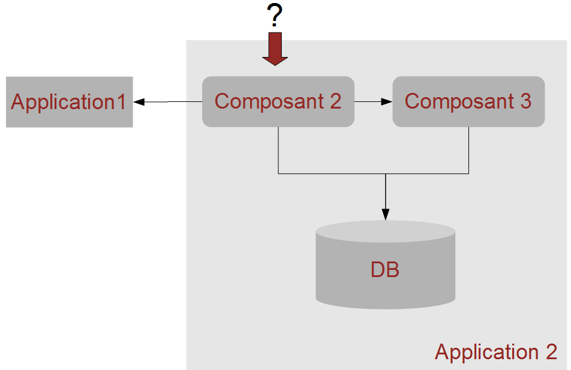
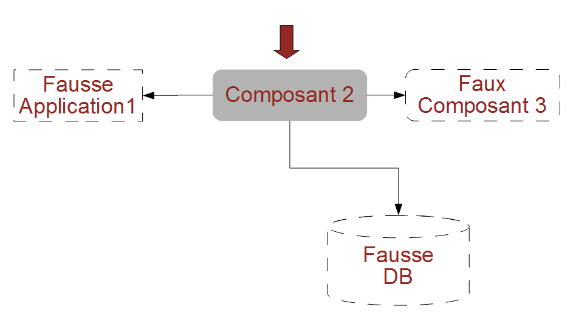
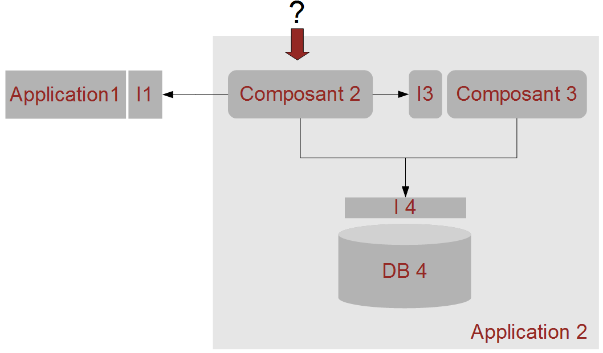
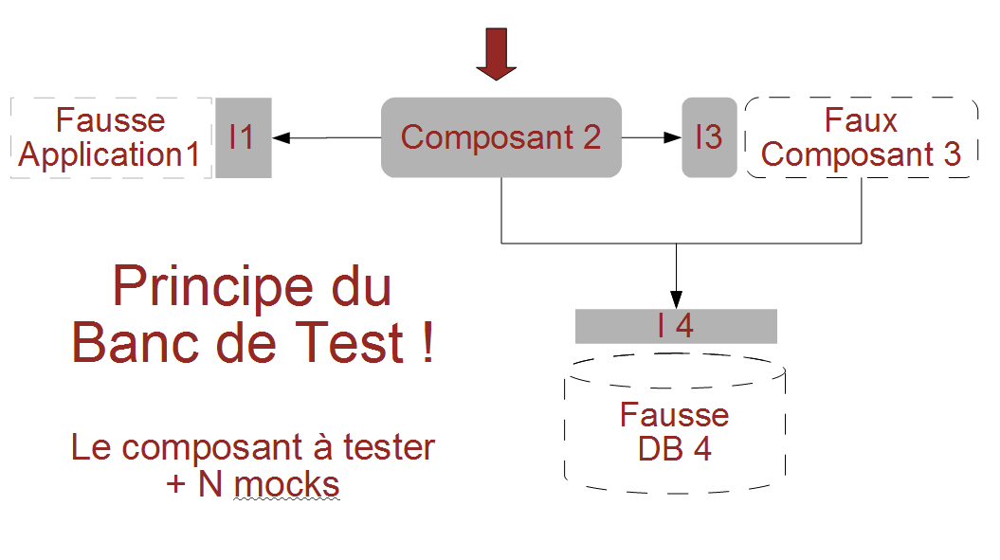

# Doublures

## Plan

- [Types de tests](#/1)
- [Doublures](#/2)
- [Couverture de tests](#/3)
- [Principes TDD](#/4)
- [Ecrire des tests maintenables](#/5)
- [Principes SOLID dans un cadre TDD](#/6)
- [Code Legacy & Refactoring](#/7)
- [Aller plus loin](#/8)
- [Annexes](#/9)

--------

## Comment tester unitairement

--------

## Test boite blanche / boite noire

--------

## Doublures - Principes

- Permet de simuler l'utilisation de composants / services lié à l'unité en isolation testée.
  - utilisation de fausses implémentations qui respectent le contrat des vraies interfaces (cf [substitution de Liskov](https://fr.wikipedia.org/wiki/Principe_de_substitution_de_Liskov)).
- Indispensables pour simuler :
  - un composant non disponible.
  - une application non accessible pendant la phase de développement.
  - un élément complexe ou long à charger (base de données, ...).

--------

## Dummy

- Le *dummy* respecte le contrat du composant (ex : implémente l'interface).
- Toutes les méthodes lèveront une exception si elles sont appelées.
- Seule la présence de l'objet est utile
  - passage en paramètre à une méthode.
  - service inutilisé pour une méthode.

--------

## Stub

- Le *stub* respecte le contrat du composant (ex : implémente l'interface).
- Une ou plusieurs méthodes sont prévues pour renvoyer toujours la même valeur fixe quelques soient les paramètres qui lui sont passés.

--------

## Spy

- Le *spy* respecte le contrat du composant (ex : implémente l'interface).
- Permet de vérifier que les appels à une méthode sont effectués.
- Il implémente des méthodes dont le but est
  - de compter le nombre d'appel à ces méthodes.
  - d'enregistrer les paramètres qui sont passés.

--------

## Mock

- Le *mock* respecte le contrat du composant (ex : implémente l'interface).
- Les *mocks* sont des implémentations simplistes
  - les méthodes répondent selon un schéma simple.
  - ils gèrent quelques cas aux limites.
- Proche du *stub* avec des traitements conditionnels.

--------

## Fake Object

- Le *fake object* respecte le contrat du composant (ex : implémente l'interface).
- Le *fake object* est fait pour mimer de fidèlement le comportement à simuler.
- Il mime de manière poussée la logique et le comportement métier de l'élément auquel il se substitue sans pour autant avoir d'interaction avec le monde réel.

--------

## Utilisation

- A l'usage ces terminologies ne sont pas cruciales.
- Il faut juste garder en tête les manières de simuler l'environnement et composer selon le besoin du test en cours
  - Le *spy* peut être utilisé avec tous les autres modèles.
  - Une doublure peut être en *dummy* sur certaines méthodes et en *fake* sur d'autres.
- L'important est de *savoir de quoi vous avez besoin*.

http://xunitpatterns.com/Mocks,%20Fakes,%20Stubs%20and%20Dummies.html

--------

## Utilisation des interfaces (1/2)

--------

## Utilisation des interfaces (2/2)

--------

## Caractéristiques d'une doublure

- Avoir l'apparence de l'objet réel simulé.
- Ne jamais contenir de code métier.
- Être simple
  - Ne doit pas avoir besoin d'être testé.
  - Les implémentations par défaut sont un bon départ.
- Peut se permettre de briser le principe de l'encapsulation.
- Est uniquement dédié aux tests unitaires ou tests d'intégration de quelques composants.

--------

## Quand utiliser une doublure ?

- Quand l'objet réel contient de la logique applicative
  - Par exemple un service Métier.
- Quand l'objet réel interagit avec un autre système
  - Autre composant logiciel.
  - Autre application.
  - Système de base de données.
  - ...
