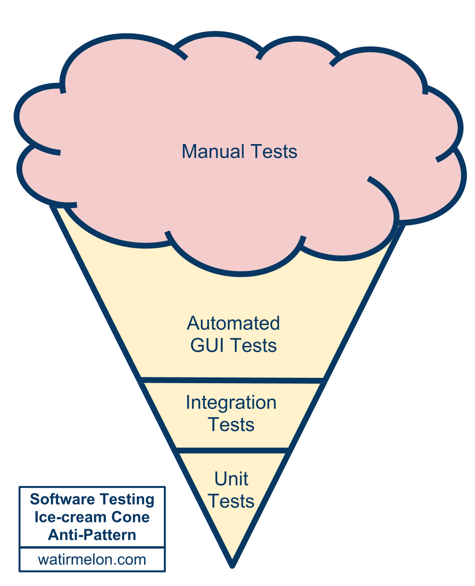
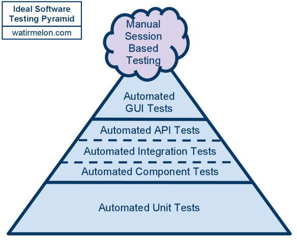
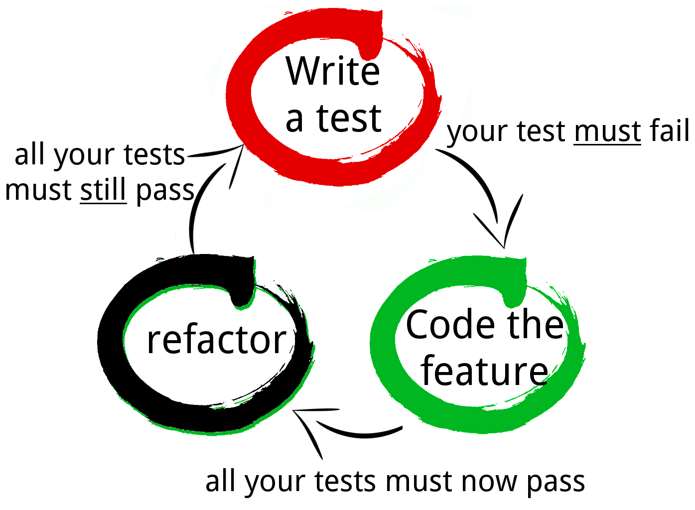

# Principes de TDD

## TDD: Test Driven Development (1/2)

- Apparaît début des années 2000.

 

- Idée générale : **écrire un test puis écrire seulement le code nécessaire     
pour le faire passer**.

--------

## TDD: Test Driven Development (2/2)

- Ce n'est pas une méthode de test :
  - **c'est une méthode de design**.

- Méthode applicable :
  - [projet] Sur un nouveau projet ou sur un projet existant.
  - [développements] Sur des nouveaux développements ou sur des corrections.

--------

## Une pratique "Extreme Programming"

<table style="width:100%">
  <tbody>
    <tr>
      <td>
       
Fine scale feedback

        <ul>
          <li>Pair Programming</li>
          <li>Planning Game</li>
          <li>**Test Driven Development**</li>
          <li>Whole team</li>
        </ul>
      </td>
      <td>
        
Continuous process

        <ul>
          <li>Continuous Integration</li>
          <li>Design Improvement</li>
          <li>Small Releases</li>
        </ul>
      </td>
    </tr>
    <tr>
      <td>
        
Shared understanding

        <ul>
          <li>Coding Standards</li>
          <li>Collective Code Ownership</li>
          <li>Simple Design</li>
          <li>System Metaphor</li>
        </ul>
      </td>
      <td>
        
Programmer welfare

        <ul>
          <li>Sustainable Pace</li>
        </ul>
      </td>
    </tr>
  </tbody>
</table>

--------

## Pourquoi TDD ? (1/4)

- Tester est obligatoire pour être sûr de son code
  - Tout le monde teste d'une manière ou d'une autre.
  - Avec un processus plus ou moins rigoureux.

- TDD propose une manière «standardisée» de considérer le Test dans le    
cycle de développement
  - Seulement la manière et non les outils.
  - Nombreux outils existant dépendant du cas de figure.

- L'écriture du test en amont oblige à réfléchir au besoin avant de     
commencer l'implémentation.

--------

## Pourquoi TDD ? (2/4)

- Sans TDD :
  - Beaucoup de tests manuels (qualification).
  - Ces tests prenant beaucoup de temps, création de tests automatisés.
  - Les automatisés sont fragiles et lents.
  - Maintenance longue et difficile.
  - Par manque de temps, les tests unitaires ne sont fait que     
  pour quelques cas.

--------

## Pourquoi TDD ? (3/4)

C'est l'anti-pattern du cornet de glace !      
(défini par [Alister Scott et Nathan Jones](http://watirmelon.com/2012/01/31/introducing-the-software-testing-ice-cream-cone/))

--------

## Pourquoi TDD ? (4/4)

Le pattern idéal (défini par [Mike Cohn](http://martinfowler.com/bliki/TestPyramid.html))

--------

## Exigences des outils

- Besoins :
  - Unité de test automatisée.
  - Assertion vraie ou fausse.
  - Exécution rapide d'une ou plusieurs unités de test.
  - Confirmation rapide de l'échec ou du succès.
- Possibilité de le faire à la main...
  - Rapidement besoin d'un framework générique.
  - Exemple dans le monde Java : JUnit, TestNG.

--------

## Le cycle TDD : présentation

- Décrit pour la première fois dans     
« Test-Driven Development by Example », Kent Beck, 2003

--------

## 1 - Ajouter un test

- Dans TDD, chaque nouveau développement commence par     
l'écriture d'un test « à faire passer ».

- Ce test doit échouer tant que la fonctionnalité n'est    
pas implémentée.

- Nécessité de bien comprendre le besoin fonctionnel     
et la spécification au moment d'écrire le test
  - Force à se poser de bonnes questions.

--------

## 2 - Lancer les tests avec échec

- Nécessité de lancer **tous** les tests
  - Pas uniquement celui qui est censé échouer.

- Le nouveau test doit échouer
  - Pour la cause prévue.

- L'échec doit survenir sur le nouveau test uniquement
  - Les autres tests doivent « passer ».
  - Ne doit pas avoir d'effet de bord sur les autres tests.

--------

## 3 - Écrire le code

- Le but est de faire passer le test, même de manière inélégante
  - Exemple : pas de factorisation de code.
  - Sera retouché par la suite.

- Important de se focaliser sur « passer le test »
  - Ne pas faire d'autres développements, ils seraient non testés.

--------

## 3 - Écrire le code

- Patterns pour faire passer le test
  - Fake it : retourner directement une constante, qui sera 
      remplacée par la suite par une variable.
  - Triangulation : à partir de deux exemples, la véritable    
  implémentation doit être écrite.
  - Obvious implementation : si l'implémentation est simple     
  et rapide, elle peut être écrite directement.
  - One to many : pour implémenter une opération ayant pour    
  paramètre une collection, il faut commencer par implémenter l'opération    
  unitairement, ensuite l'implémenter avec la collection.

Notes :
Fake it et Triangulation permettent de maintenir le cycle du TDD        
et sont moins exigeantes intellectuellement.

--------

## 4 – Lancer les tests avec succès

- Nécessité de lancer **tous** les tests
  - Pas uniquement celui qui est censé passer.

- Aucun tests ne doit échouer
  - Ni le nouveau ni les autres (anciens).

- Indique que le code exécute bien ce pour quoi il a été développé.

--------

## 5 - Refactoriser et relancer

- Maintenant, le code peut être nettoyé et refactorisé au besoin
  - Possibilité de modifier le code existant pour factoriser    
  par exemple une partie de code dupliquée.

- Puis en relançant tous les tests avec succès
  - Certitude de ne pas avoir « cassé » une fonctionnalité lors du refactoring.

--------

## Les 3 règles du TDD de l'Oncle Bob

Uncle Bob (Robert Martin) a définit 3 régles :

- Vous n'êtes pas autorisé à écrire du code de production,     
sauf si c'est pour de faire passer un test unitaire en échec.
- Vous n'êtes pas autorisé à écrire plus de test unitaire qu'il    
ne faut pour avoir un échec; et les échecs de compilation sont des échecs.
- Vous n'êtes pas autorisé à écrire plus de code de production     
que necessaire pour faire passer un test unitaire qui était en échec.

Plus d'informations : http://www.butunclebob.com/ArticleS.UncleBob.TheThreeRulesOfTdd

--------

## Le Cycle TDD : conclusion

- Le cycle est alors répété avec une nouvelle fonctionnalité.

- Comme dans tous les cycles, nécessité de la bonne taille dans     
chaque itérations.

- Itérations de tailles variables
  - Dépend du développeur, de son expérience et de sa confiance en lui.
  - Si les itérations sont trop longues (ex: 1 j d'écriture de test),    
  nécessité de découper la fonctionnalité en sous-fonctionnalités.

--------

## Design émergent - Principes

- L'architecture n'est pas définie totalement avant de commencer    
à coder (_Design upfront_)
  - L'architecture émerge des tests qui sont créés.
  - Elle reste aussi simple que possible.
  - Suffisante pour faire passer les tests.

--------

## Design émergent - Pratique

- Écrire un test pour une fonctionnalité.
- Si la méthode est trop compliquée, créer une dépendance et     
  déléguer une partie du traitement à cette dépendance
  - _Diviser pour mieux régner_
- Mocker les dépendances pour faire passer le test.
- Appliquer la même méthode aux dépendances jusqu'à arriver    
à des classes simples qui ne font qu'une chose.
- Ne pas hésiter à effectuer du refactor quand c'est nécessaire    
pour continuer à faire évoluer l'architecture.

--------

## Design émergent - Principe YAGNI (1/2)

 

<!-- .element class="alert alert-info"-->
YAGNI (*Y*ou *A*in't *G*onna *N*eed *I*t) : "vous n'en aurez pas besoin"

- Demande de n'écrire que le code strictement nécessaire, afin d'éviter    
de piège de l'over-architecture (architecture non justifiée).
- Nous sommes tous tenté d'ajouter des fonctionnalités maintenant    
plutôt que plus tard, parce que nous voyons exactement comment les    
ajouter ou parce qu'elles rendraient le système tellement mieux.
- Dérivé du principe XP : Ne jamais ajouter de fonctionnalité trop tôt.
- Ajouter une flexibilité supplémentaire au-delà de ce qu'il est     
nécessaire pour l'instant rends toujours la conception plus complexe.

 

<!-- .element class="alert alert-warning"-->
Il faut se concentrer sur ce qui est prévu.

--------

## Design émergent - Principe YAGNI (2/2)

- Écrire du code non nécessaire pour l'instant dans une optique de    
l'utiliser plus tard produit différents problèmes :
  - alourdissement de la base de code.
  - source de bugs et de complexité non justifiée.
  - l'implémentation d'une fonctionnalité sans définition sera dans    
  90% du temps inadapté au besoin futur.
  - allongement du temps de développement sans justification directe    
  (documentation et tests supplémentaires).

 

<!-- .element class="alert alert-danger"-->
YAGNI n'est pas une justification pour négliger la qualité de votre code.    
YAGNI nécessite (et permet) du code malléable.

--------

## Design émergent - Design Patterns

- Value Object
  - Objet immuable.
  - Deux objets sont égaux si leurs champs sont égaux.
- Null Object
  - Son implémentation est vide.
  - Évite de tester la nullité.
- Factory method
  - Crée un objet par une méthode et non plus directement par    
  le constructeur.
  - Encapsule la création d'objet.

--------

## Design émergent - Design Patterns

- Template method
  - Standardise une séquence avec des implémentations par défaut
  - Les comportements spécifiques sont implémentés dans les    
  sous-classes
- Composite
  - Traite de manière identique un groupe et un élément

--------

## Tester les méthodes privées ?

- En un mot : Non.

- Une méthode privée ne doit pas être testée.
  - C'est un détail d'implémentation.
  - Elles sont testées de manière indirecte par les tests sur    
  les méthodes publiques.
  - Si une méthode privée est trop complexe pour être testée     
  entièrement via les méthodes publiques.
    - Il faut considérer le fait d'extraire la méthode privée     
    dans une classe séparée, qui peut être testée unitairement.

Notes :
Exemple d'une liste qui doit se redimensionner à chaque add et remove
-> la logique de redimensionnement est typiquement dans une méthode     
privée et devrait être extraite afin de pouvoir être bien testée
(les TU sur la liste vont se contenter de tester add et remove de     
manière simple sans se soucier de la taille interne)

--------

## TDD : Avantages (1/2)

- Impact positif sur le design du code
  - Le fait de « penser test » pousse
    - à fragmenter les grosses fonctionnalités complexes pour les     
    rendre testables.
    - à utiliser le principe de *design par contrat* (utilisation     
    des interfaces en Java).
- Une qualité et une confiance accrues
  - Chaque fonctionnalité étant testée, la totalité du code est donc testée
    - Meilleure qualité globale de l'application.

--------

## TDD : Avantages (2/2)

- Un temps de développement identique ou inférieur
  - Plus de code à écrire avec TDD que sans TDD : vrai.
  - Mais la suppression de bug au plus tôt permet de diminuer     
  drastiquement le coût de la résolution.
  - Peut être très élevé en cas de détection tardive.
- Une utilisation moins fréquente du debugger
  - Code déjà testé « fonctionnalité par fonctionnalité » donc presque    
  en mode « pas à pas » : moins de mauvaises surprises.

--------

## TDD : Inconvénients (1/2)

- Peut produire le pire s'il n'y a aucune communication dans     
l'équipe : Test**er** Driven Development
  - Obligation de revues de code et de discussions pour vérifier    
  que le design du code reste cohérent sur l'application (pas    
  seulement que le code implémente bien les fonctionnalités).

--------

## TDD : Inconvénients (2/2)

- Nécessité de savoir ce qui doit et ne doit pas être testé
  - Ne pas tester des API du langages ou des frameworks connexes au    
  projet : coûts importants et totalement inutiles.
  - Ne pas tester les bases de données : une BDD fonctionne toujours.
  - Ne pas tester plusieurs fois la même fonctionnalité dans le    
  cas d'une factorisation de code par exemple.

- Difficulté pour tester les IHM.

--------

## Conclusion

- Tester : un sujet important et unanimement partagé.
- TDD : méthode simple mais reste « théorique »
  - Nécessité de mettre en pratique.
