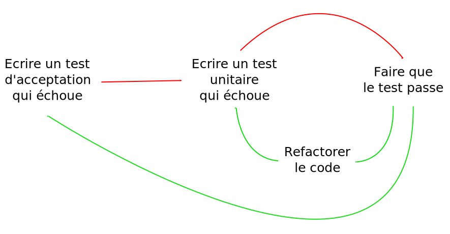

# Aller plus loin

<!-- .slide: class="page-title" -->

## Plan

<!-- .slide: class="toc" -->

- [Types de tests](#/1)
- [Doublures](#/2)
- [Couverture de tests](#/3)
- [Principes TDD](#/4)
- [Ecrire des tests maintenables](#/5)
- [Principes SOLID dans un cadre TDD](#/6)
- [Code Legacy & Refactoring](#/7)
- [Aller plus loin](#/8)
- [Annexes](#/9)

Notes :

## BDD

- __Behaviour Driven Development__
- Utilisation de langage naturel du domaine pour écrire les tests.
   - Langage commun entre développeurs et fonctionnels.
   - Des outils permettent de traduire les tests écrits en français en code.
- Encourage la collaboration entre les développeurs et les fonctionnels.
- Les tests et les spécifications du logiciel sont confondus.

Notes :

## ATDD

- __Acceptance Test Driven Development__
- Définition de critères d'acceptation
   - Collaboration entre fonctionnels et développeurs pour définir les critères.
   - Les tests sont écrits pour vérifier que les critères sont validés.

Notes :
Les critères d'acceptation peuvent être écrits dans les US. Avec des exemples c'est mieux.

## Comparaison BDD et ATDD

- Les tests se concentrent sur les fonctionnalités et non pas sur les détails techniques.
- Les tests BDD sont directement utilisables tandis que les tests ATDD sont dérivés
   - Les tests BDD sont écrits en français et traduits en code ensuite.
   - Les tests ATDD sont dérivés des critères d'acceptation définis (dans une story par exemple).
- Les deux méthodes sont couplables avec TDD car les tests ne sont pas au même niveau de granularité.
   - Il s'agit de tests d'intégration.
   - Utilisation de la double boucle.

Notes :

## Double boucle

  

Notes :

## Kata & Coding Dojo (1/2)

- Comme dans les arts martiaux, il est nécessaire de s'exercer pour s'améliorer.
- Les katas sont des exercices permettant de s'entraîner sur un point particulier (TDD, refactoring, ATDD, etc.)
   - Il est possible de refaire un kata des dizaines de fois avec, à chaque fois, un objectif ou une méthode différents.
   - Les katas ne sont en général pas très longs à faire (quelques heures tout au plus).
   - Il n'y a pas de "bonne réponse", il s'agit d'un prétexte pour s'entraîner.

Notes :

## Kata & Coding Dojo (2/2)

- Un Coding Dojo est une rencontre entre développeurs pour s'exercer.
- L'apprentissage est collectif et peut prendre plusieurs formes.
   - Résolution de katas.
   - Pair programming.
   - Mob programming.
- Dans tous les cas, l'idée est de partager le savoir.
   - Revue de code finale.
   - Partage des solutions.

Notes :
Mob programming : un écran central, des devs qui tournent et les autres qui ont un PC perso et qui aident l'avancement.
Pair programming : Dev à 2 ou 3 devant un poste. Les paires travaillents en parallèles et peuvent tourner.

## Intégration continue

- Vérification en continu de la non régression
   - Récupère le code source depuis un SCM.
   - Exécute les tests automatisés.
   - Signale et *stoppe la chaîne* si un des tests échoue.
- Analyse statique de la qualité du code.
- Génération et déploiement automatique en continu
   - Etape ignorée si les tests ne passent pas.

Notes :

<!-- .slide: class="page-questions" -->
